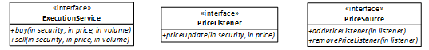

## User Story

As a trader I want to be able to monitor stock prices such that when they breach a trigger level orders can be executed automatically.

## Exercise

Given the following interface definitions (provided)

Develop an implementation of the PriceListener interface that provides the following behaviour:

- Connects to a PriceSource instance
- Monitors price movements on specified stock(s), e.g. "IBM"
- Executes a single "buy" instruction for a specified number of lots e.g. 100, as soon as the price of that stock is seen to be below a specified price e.g. 55.0

## Guidance

- We would like your solution to be indicative of your work on a production codebase, particularly in terms of design and testing approach.
- A Maven build file has been provided configured for Java 11 to get you going, but feel free to downgrade if required or upgrade if it warrants it
- JUnit 4 has been added but feel free to switch to JUnit 5
- You may add helper libs so long as they are publicly available e.g. Maven Central, Github - be prepared to discuss this during the review 
- We anticipate it may take ~1 hour to complete. Though we've not set a time limit, we don't want you to spend excessive amounts of time working on this, it is fine to point out improvements or refactoring as *TODOs*.
- If any aspect of the requirements are unclear, please make a sensible interpretation – you may want to state assumptions or follow-up questions you might ask.

When complete, we will organise a phone call to walk through your solution. Please liaise with the recruitment team to let them know when you expect to be ready for this, so we can schedule a call in advance.

We appreciate your time and look forward to seeing your solution!
